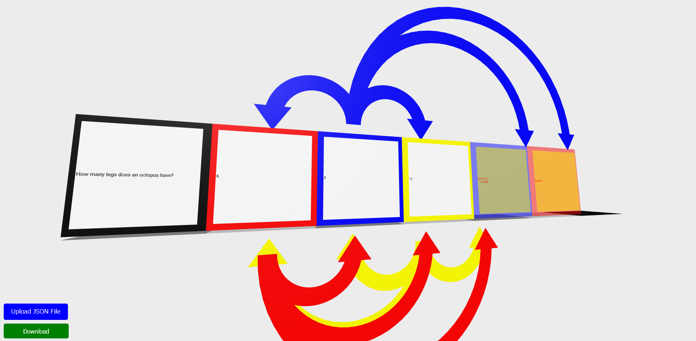
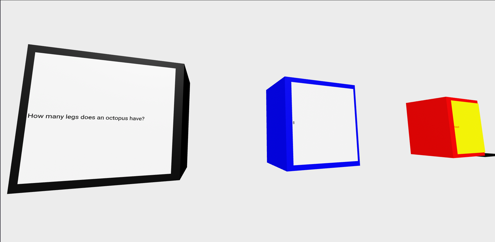
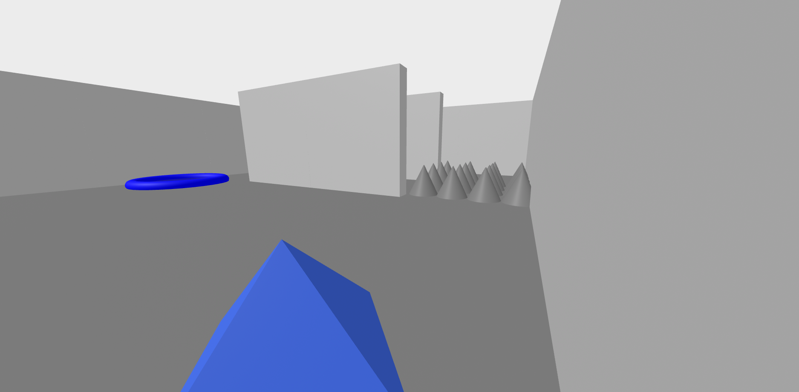

# 仮想脱出室の作成を通したプログラミング教育システム






## 概要

児童を対象とする, プログラミング学習の文脈において, 3D 脱出室の開発を通して, プログラミング的思考能力の養成を目指すシステムです.  
具体的には, 以下の脱出室の開発を通して, プログラミング学習を行います.

- 多肢選択肢クイズ空間 / Multi-choice Escape Rooms
- 迷路空間 / Maze Escape Rooms

### 多肢選択肢クイズ空間 / Multi-choice Escape Rooms

### 迷路空間 / Maze Escape Rooms

## 実行方法

以下サイトに遷移してください: このへんに glitch の URL  
または, git がある場合, [https://github.com/srkok/escape-room-maker] から clone してください.

```
git clone https://github.com/srkok/escape-room-maker.git
```

または GitHub リポジトリ Web ページ上で, 緑色の「<> Code」ボタンを押下し, 「Download ZIP」によりダウンロードした zip ファイルを解凍し, そのフォルダ内の「index.html」ファイルを左クリックしてください.

## 実験にご協力ください.

- まず, [実行方法](#実行方法)から本プログラムを実行できる状態に移ってください.

  - この際, GitHub リポジトリをクローン/ダウンロードしない場合, GitHub 内の「sample_jsonfile」フォルダ内のファイルを全てローカルに保存してください.

    - git がある場合, 以下を実行してください.

    ```
    git clone --no-checkout https://github.com/srkok/escape-room-maker.git
    cd escape-room-maker
    git sparse-checkout init --cone
    git sparse-checkout set sample_jsonfile
    git checkout
    ```

    - git がない場合, GitHub リポジトリにて, 「sample_jsonfile」フォルダを押下後, 各ファイルに対して押下 -> 「Dounload raw file」ボタンを押下し, 任意の場所に保存してください.

### 多肢選択肢クイズ空間 / Multi-choice Escape Rooms

### 迷路空間 / Maze Escape Rooms

### アンケート回答

以下リンク先より, 本実験のアンケート回答をお願いします.

ご協力ありがとうございました.

## FAQ

### 共通

- 何も表示されません.

  - 本プログラムは, 全て javascript にて動作しています. javascript を有効化しリロードしてください.

- 自らの環境にクローン/ダウンロードしましたが, オフラインで動きません.

  - 仕様です.
  - オフラインで動かしたい場合, まず aframe のドキュメント [https://aframe.io/docs/1.6.0/introduction/installation.html] や GitHub リポジトリ [https://github.com/aframevr/aframe/] を適宜参照し, ローカルに「aframe.min.js」ファイルを保存してください. その後, 本プログラムの「index.html」ファイルを除くすべての html ファイルには`<script src="https://aframe.io/releases/1.6.0/aframe.min.js"></script>`の記載がありますが, これらをローカルに保存した「aframe.min.js」ファイルへのパスに変更してください. 例えば「Downloads」フォルダに保存した場合は`<script src="C:\Users\(ユーザ名)\Downloads"></script>`と変更してください.

- 開発で, リロードすると, 作業中のものが全て消えました.

  - 仕様です.
  - 消したくない場合, 「Download」ボタンを押下し, json ファイルをローカルにダウンロードしておいてください.
  - 再開したい場合, 「Upload JSON File」ボタンを押下し, ローカルの json ファイルを指定することで,保存されていた状態から再開できます.

- 開発で, 作業中に「Upload JSON File」ボタンを押下し, ローカルの json ファイルを指定すると, 現在作業中だったものが全て消えました. / 上書きされました.

  - 仕様です.
  - 上と同様の対応をお願いします.

- 開発で, 「Upload JSON File」ボタンを押下し, ローカルの json ファイルを指定しても, うまくロードされません.

  - 脱出室の種類が誤っている可能性があります.
  - 多肢選択肢クイズ空間 / Multi-choice Escape Rooms の開発空間では 多肢選択肢クイズ空間 / Multi-choice Escape Rooms でダウンロードされた json ファイルのみ読み込むことができます.
  - 迷路空間 / Maze Escape Rooms の開発空間では 迷路空間 / Maze Escape Rooms でダウンロードされた json ファイルのみ読み込むことができます.

- 実行で, 進行不能になりました.
  - リロードし, 再度 json ファイルを読み込んで実行してください.
  - 開発内容によっては, 満足に開発構想を達成できていないことがあります. よければ再度開発空間に戻って, 正しく各種動作が開発構想に基づき定義されているかどうか確認してみてください.

### 多肢選択肢クイズ空間 / Multi-choice Escape Rooms

- 開発で, 新たに Grid を設定しようとした時, 前回の設定が menu に残っています.

  - 既知の不具合です.
  - これを変更し apply しても, 前回設定した Grid への影響はありません.

- 開発で, 設定済みの Grid を再設定する際, clickable menu が初期化されています.

  - 既知の不具合です.
  - clickable menu の設定は, 開発する脱出室の全体像を掴んでからをお勧めします.
  - もし誤って設定済みの Grid をクリックした場合, 設定メニューの外部の適当な場所をクリックすれば, 変更をキャンセルします.

### 迷路空間 / Maze Escape Rooms

- 開発で, 本来オブジェクトを配置するだろうところにテキストブロックが配置できてしまいます. / 本来テキストブロックを配置するだろうところにオブジェクトが配置できてしまいます.

  - 既知の不具合です.
  - 配置できるだけで, 内部の脱出室空間構成用データには一切変更されないはずですが, 誤って配置してしまった場合は, 念の為本来配置したかったものを再度配置してください.

- 開発で,一度オブジェクトの init visibility / action target を設定した後, オブジェクトを離すと, 配置したテキストブロックがその場に残り続けますが, 内部データとしてはどのような扱いですか.

  - オブジェクトを離した時点で, 該当 Grid におけるオブジェクトの各種情報は全てリセットされます.

- 開発で,一度オブジェクトの init visibility / action target を設定した後, オブジェクトを離し, 再度オブジェクトを配置すると, まるで配置したかのようにテキストブロックがその場に残り続けますが, 内部データとしてはどのような扱いですか.

  - オブジェクトを離した時点では, 該当 Grid におけるオブジェクトの各種情報は全てリセットされます.
  - その後オブジェクトを配置した際, 当該メニューに既にテキストブロックが配置されていたかどうかの判定が行われます.
  - 結果として, オブジェクト配置 -> メニューにテキストブロック配置, と同様の内部データとなります.

- 実行で, 壁が何故かクリックできます.
  - 仕様です. クリックしても何も起こりません.
  - aframe の仕様で, クリック可能なオブジェクトの上に, クリック不可能なオブジェクトを配置しても, 奥にあるオブジェクトがクリックできてしまいます. 本プログラムではそれを回避するために, 壁をクリック可能としています.

#### 自分用.

やったこと：

- 多肢選択肢クイズ脱出室開発空間の完成.(UI に変更の余地あり)
- playground の拡張.
- drag_and_drop の実装(砂場レベル).
- mazeER の drag & drop レイアウト実装.
- mazeER の大きさ拡張ボタンの実装.
- 作業状態の save.
  - object/textblock 配置時に, saveRegistry が動くようにした.
  - object/textblock を除いたとき, saveRegistry での delete が動くようにした.
  - object/textblock を除いたとき, menu が消えるようにした.
  - object 配置時に, 既に menu 上に textblock があれば saveRegistry が動くようにした.
- 動作指定用ブロックビルディング環境の製作.
- 迷路脱出室開発空間の製作.
  - init による object/textblock の repop.
  - 作業状態の load.
    - registry に従って object なり設定項目なりも湧くようにする.
    - registry を読んで initMazeMaker 動かすだけなので, すぐ終わりそう.
- 多肢選択肢クイズ開発空間の改良.
  - 矢印の color を, outerColorPicker に依存させた.
- 迷路脱出室 playground の製作.
  - grid, wall を, 動的に配置できた.
  - object の配置, 機能を有効化した.
- 多肢選択肢クイズ開発空間の改良.
  - 設定メニュー表示時に,バックアップの呼び出し.
    - 何もないところをクリックしたときに, 前作ったのがそのままなのは別にいいと思う.
    - 既に編集したやつをクリックしたときに, 全然関係ないのが表示されるのは少し面倒だと思う.
    - popup の registerComponent にて, クリック後, registry に既に name があれば, そこからバックアップを各種 Picker などに呼び出したのち, Modal を表示させる.

やること：

- アンケート作成.

やるかもしれないこと：

やらないこと：

- パーツメーカー
- 迷路脱出室開発空間の製作.
  - 動作指定用ブロックビルディング環境の製作.
    - 入力後、矢印オブジェクトが発生するようにする?(future)
