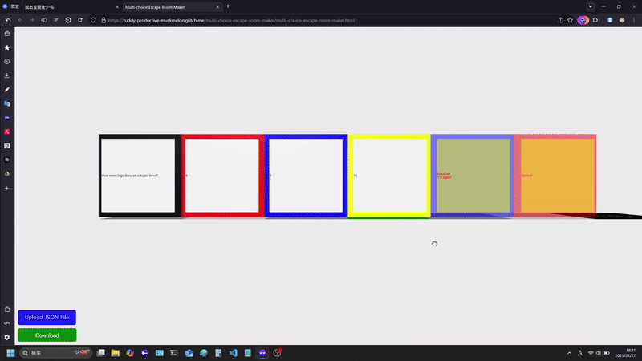
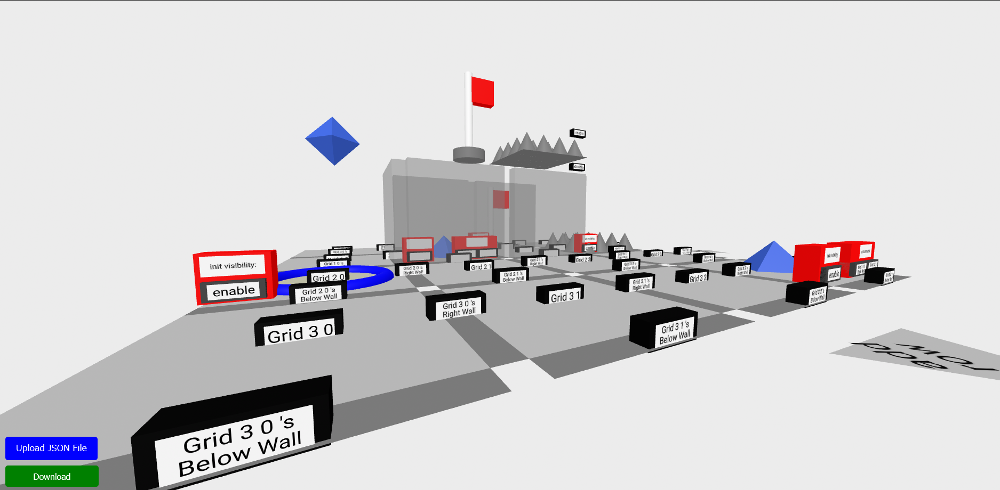
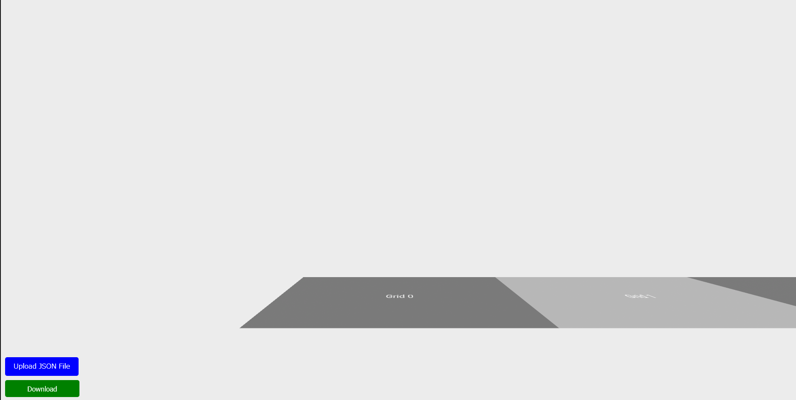
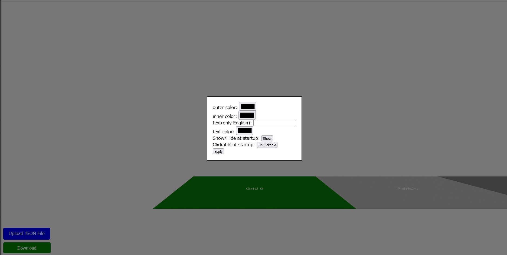
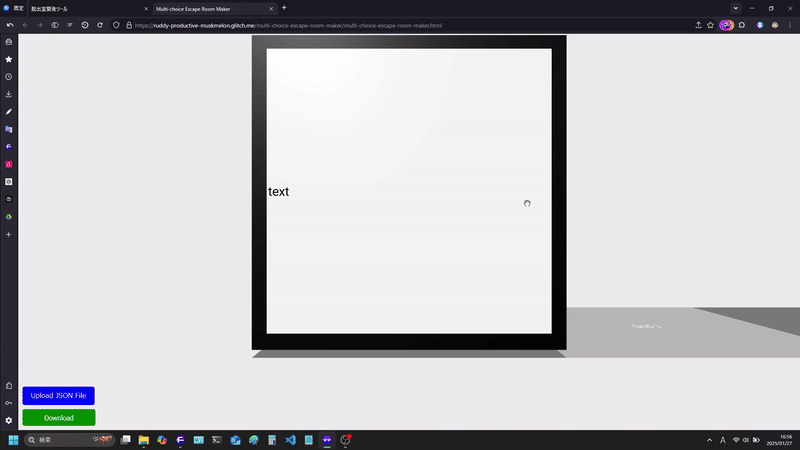
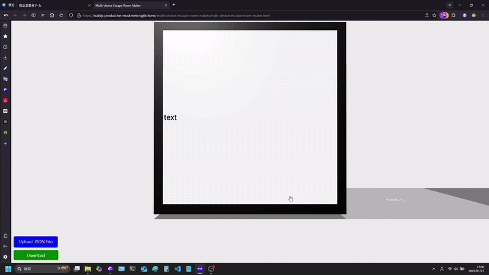
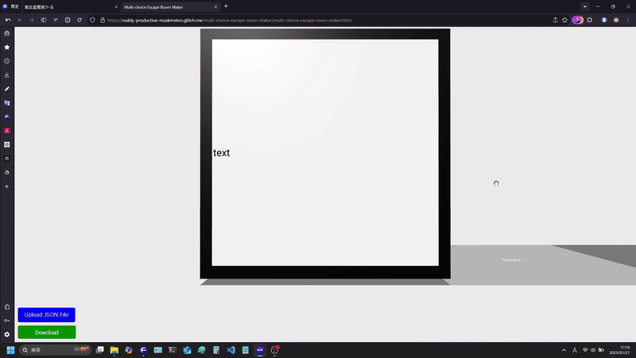
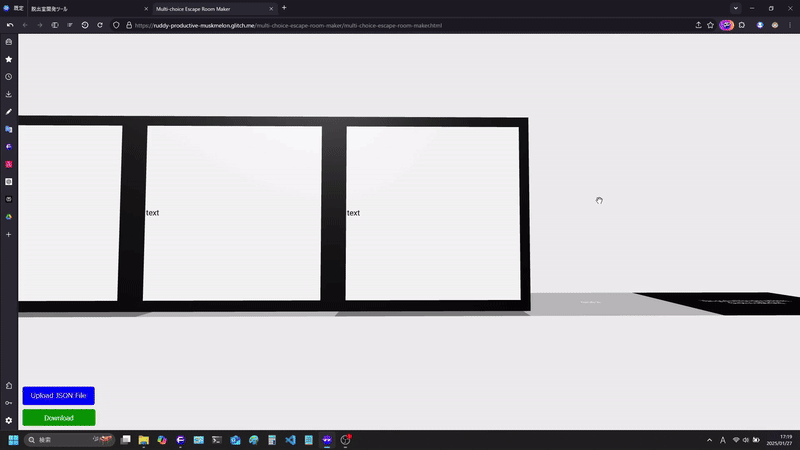
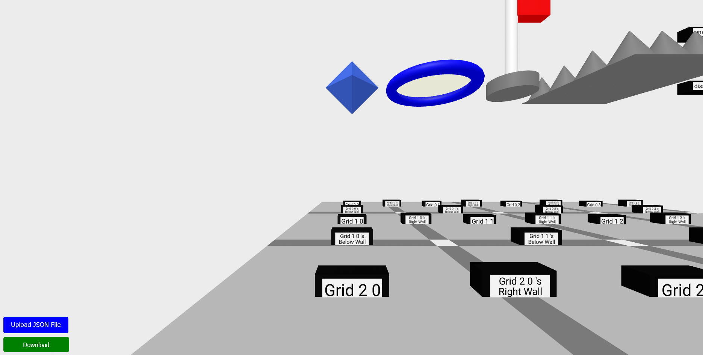
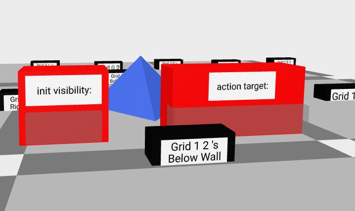

# 仮想脱出室の作成を通したプログラミング教育システム






## 目次

- [概要](#概要)
  - [基本操作](#基本操作)
  - [多肢選択肢クイズ空間 / Multi-choice Escape Rooms](#多肢選択肢クイズ空間--multi-choice-escape-rooms)
    - [機能説明](#機能説明)
  - [迷路空間 / Maze Escape Rooms](#迷路空間--maze-escape-rooms)
    - [機能説明](#機能説明-1)
- [実行方法](#実行方法)
- [実験にご協力ください.](#実験にご協力ください)
  - [多肢選択肢クイズ空間 / Multi-choice Escape Rooms](#多肢選択肢クイズ空間--multi-choice-escape-rooms-1)
  - [迷路空間 / Maze Escape Rooms](#迷路空間--maze-escape-rooms-1)
  - [アンケート回答](#アンケート回答)
- [FAQ](#faq)
  - [共通](#共通)
  - [多肢選択肢クイズ空間 / Multi-choice Escape Rooms](#多肢選択肢クイズ空間--multi-choice-escape-rooms-2)
  - [迷路空間 / Maze Escape Rooms](#迷路空間--maze-escape-rooms-2)

## 概要

児童を対象とする, プログラミング学習の文脈において, 3D 脱出室の開発を通して, プログラミング的思考能力の養成を目指すシステムです.  
具体的には, 以下の脱出室の開発を通して, プログラミング学習を行います.

- 多肢選択肢クイズ空間 / Multi-choice Escape Rooms
- 迷路空間 / Maze Escape Rooms

### 基本操作

| 操作                                               | 説明                                    |
| -------------------------------------------------- | --------------------------------------- |
| W キー / 上矢印キー                                | 現在地点から見て 前 方向に移動します.   |
| A キー / 左矢印キー                                | 現在地点から見て 左 方向に移動します.   |
| S キー / 下矢印キー                                | 現在地点から見て 後ろ 方向に移動します. |
| D キー / 右矢印キー                                | 現在地点から見て 右 方向に移動します.   |
| 何もないところをクリックしたまま任意方向にドラッグ | カメラアングルが調整できます.           |

### 多肢選択肢クイズ空間 / Multi-choice Escape Rooms

「クリックすると, 対象の可視性を反転させる」機能のみを利用し, 「多肢選択肢クイズ空間」の開発を実行できます.

#### 機能説明

アクセスすると, 以下の状態となります.


- 任意の Grid をクリックすると, ブロックの設定ができます. 既に設定済みのブロックについて変更を加えたい場合にも, Grid をクリックして設定してください.
- 「Upload JSON File」ボタンでは, 前回作業した状態が保存してある json ファイルを読み込むことで, 作業状態を復元できます.
- 「Download」ボタンでは, 現在の作業状態を json ファイルとして保存できます.
- 最右 Grid では, この位置に脱出室の出口が設定されます. また, より多くの Grid を追加したい場合, この最右 Grid をクリックすることで追加されます.

Grid をクリックすると, 以下のメニューが表示されます.


| 設定項目             | 説明                                                                                                                                                                                                                                    |
| -------------------- | --------------------------------------------------------------------------------------------------------------------------------------------------------------------------------------------------------------------------------------- |
| outer color          | ブロックの色を設定できます. <details></details>                                                                                                                       |
| inner color          | テキストを表示する平面領域の色を設定できます.<details></details>                                                                                                      |
| text                 | ブロックに表示するテキストを設定できます. アルファベット, 半角数字/記号のみ反映されます. 改行したい場合, 「\n」と入力してください.<details></details>                             |
| text color           | ブロックに表示するテキスト文字色を設定できます.<details></details>                                                                                                      |
| Show/Hide at startup | 起動時にブロックを表示するかどうかを選択できます. 「Show」では表示, 「Hide」では非表示となります. <details></details>                                                       |
| Clickable at startup | ブロックをクリック可能にするか選択できます. 「UnClickable」ではクリック不可能, 「Clickable」ではクリック可能となります.                                                                                                                 |
| color when selecting | マウスカーソルがブロック上に存在するときのブロック色を変更します. これにより, ブロックがクリック可能であるかどうかが分かりやすくなります. <details></details> |
| action target        | クリックしたときに可視性を反転させる対象を選択します. 複数選択したい場合, 「ctrl」キーを押しながら選択してください. <details></details>                           |

- 選択後, 「apply」ボタンを押下すると, 設定が反映されたブロックが生成されます.
- 「action target」を指定していた場合, 可視性反転対象ブロックへ矢印が示されます.

### 迷路空間 / Maze Escape Rooms

「クリックすると, 2 つまでの対象の可視性を反転させる」機能を利用し, 「迷路空間」の開発を実行できます.

#### 機能説明

アクセスすると, 以下の状態となります.


- 各正方形 Grid の間には細長いグレーの Grid がありますが, これは迷路の壁を設定する Grid です. クリックすると, 脱出開始時に壁を設けるように設定されます. もう一度クリックすると解除されます.
- 「add row/column」ボタンでは, 1 回押すごとに迷路の行数/列数を +1 できます.
- 「Upload JSON File」ボタンでは, 前回作業した状態が保存してある json ファイルを読み込むことで, 作業状態を復元できます.
- 「Download」ボタンでは, 現在の作業状態を json ファイルとして保存できます.

以下のオブジェクトは, ドラッグアンドドロップにより配置可能です. スタート位置オブジェクト以外は, 何個でも配置可能です. また, 正しい位置に配置することで迷路脱出室の設定ができます.

| オブジェクトの種類                     | 説明                                          |
| -------------------------------------- | --------------------------------------------- |
| 青の正八面体(クリック可能オブジェクト) | クリックできます.                             |
| 青の円(スタート位置オブジェクト)       | ここから脱出者はスタートします.               |
| 旗(ゴール)                             | ここから脱出者は脱出します.                   |
| 円錐の密集(針罠)                       | 脱出者はこの上を通れません.                   |
| enable/disable テキストブロック        | 脱出開始時のオブジェクトの可視性を定義します. |
| Grid x y テキストブロック              | action target を設定するテキストブロックです. |

- テキストブロック以外のオブジェクトは, 各正方形 Grid に配置できます. 配置すると, 追加の設定項目が設定可能となります.
  
  - init visibility: 起動時にオブジェクトを表示するかどうかを選択できます. 「enable」では表示, 「disable」では非表示となります. 何も設定しなければ, 「disable」として扱われます.
  - action target: クリックしたときに可視性を反転させる対象を選択します. 2 つまでを対象として選択できます.

## 実行方法

以下サイトに遷移してください: [glitch_play]  
または, git がある場合, 本プログラムの [Github リポジトリ][github]から clone してください.

```
git clone https://github.com/srkok/escape-room-maker.git
```

または [GitHub リポジトリ][github] Web ページ上で, 緑色の「<> Code」ボタンを押下し, 「Download ZIP」によりダウンロードした zip ファイルを解凍し, そのフォルダ内の「index.html」ファイルを左クリックしてください.

## 実験にご協力ください.

- まず, [実行方法](#実行方法)から本プログラムを実行できる状態に移ってください.

  - この際, [GitHub リポジトリ][github]をクローン/ダウンロードしない場合, GitHub 内の「sample_jsonfile」フォルダ内のファイルを全てローカルに保存してください.

    - git がある場合, 以下を実行してください.

    ```bash
    git clone --no-checkout https://github.com/srkok/escape-room-maker.git
    cd escape-room-maker
    git sparse-checkout init --cone
    git sparse-checkout set sample_jsonfile
    git checkout

    ```

    <details><summary>実行できない場合は, 以下を１行づつコピー&ペーストしてください.</summary>

    ```
    git clone --no-checkout https://github.com/srkok/escape-room-maker.git
    ```

    ```
    cd escape-room-maker
    ```

    ```
    git sparse-checkout init --cone
    ```

    ```
    git sparse-checkout set sample_jsonfile
    ```

    ```
    git checkout
    ```

    </details>

    - git がない場合, [GitHub リポジトリ][github]にて, 「sample_jsonfile」フォルダを押下後, 各ファイルに対して押下 -> 「Download raw file」ボタンを押下し, 任意の場所に保存してください.

### 多肢選択肢クイズ空間 / Multi-choice Escape Rooms

advanced と書かれているものは, 達成にそれなりに時間がかかると思われます.
アンケートに際し, 必ずしも全てを 100%達成しなければならない訳ではないため, いいところで区切りをつけて次に進んでもらっても構いません.

1. サンプルの脱出室をプレイします.
   - 
   1. ファイル「index.html」内の, 「Let's escape!」リンクをクリックします.
   2. 文字列「JSON ファイルを選択してください」をクリックし, ローカルの json ファイル選択画面を開いてください.
   3. 事前にローカルにダウンロードした json ファイル「multiChoice_registry_2024-10-09_05-53-26.json」を選択してください.
   4. 実際に空間内を[基本操作](#基本操作)に従い, 移動可能なことを確認してください.
   5. 空間内には, 最左ブロックにクイズの問題文が表示されています. 解答として正しい数値が書かれているブロックを空間内から選んでクリックしてください.
   - 正しい解答のブロックをクリックすると, 「Correct!」と書かれたブロックと, その右に「Goal (改行) Step on this square!」と書かれた Grid が可視化されます.
   6. 「Goal (改行) Step on this square!」と書かれた Grid の真上に来るよう移動すると, 脱出成功のメッセージが表示されることを確認してください.
2. サンプルの脱出室を作成します.

   1. ファイル「index.html」内の, 「Make Multi-choice Escape Room!」リンクをクリックします.
   2. 空間内を[多肢選択肢クイズ空間 / Multi-choice Escape Rooms の機能説明](#機能説明)に従い,動かし, 先ほど動かしたサンプルの脱出室を作成してください.

   - 自身の解答が正しくサンプルのように機能するかは, 完成した状態で「Download」ボタンを押下し保存後, サンプルの脱出室をプレイした際と同様の操作により確認できます.
   - 模範解答は, 「Upload JSON File」ボタンを押下し, json ファイル「multiChoice_registry_2024-10-09_05-53-26.json」を選択することで確認できます.
   - <details><summary>模範解答は, このようにして作成されました. </summary>

     

     </details>

3. (advanced)自由な問題設定で, 脱出室空間を開発してください.
   - 特に思いつかない場合, 以下を開発するにはどうすればよいか考えてみてください.
     - 4 つの選択肢のうち, 2 つを解答する形式のクイズ空間.
       - e.g. Select two animals from the following that are classified as mammals. A: Penguin, B: Bat, C: Dolphin, D: Turtle
     - 複数の選択肢のうち, 任意個数を解答する形式のクイズ空間.
       - e.g. Select all the factors necessary for plant seed germination from the options below. A: Soil B: Water C: Light D: Air E: Temperature
     - 解答として２桁の数値を指定する形式のクイズ空間.
       - e.g. How many prefectures are there in Japan?

### 迷路空間 / Maze Escape Rooms

advanced と書かれているものは, 達成にそれなりに時間がかかると思われます.
アンケートに際し, 必ずしも全てを 100%達成しなければならない訳ではないため, いいところで区切りをつけて次に進んでもらっても構いません.

1. サンプルの脱出室をプレイします.
   1. ファイル「index.html」内の, 「Let's escape!」リンクをクリックします.
   2. 文字列「JSON ファイルを選択してください」をクリックし, ローカルの json ファイル選択画面を開いてください.
   3. 事前にローカルにダウンロードした json ファイル「maze_registry_2025-01-21_11-38-06.json」を選択してください.
   4. 実際に空間内を[基本操作](#基本操作)に従い, 移動可能なことを確認してください. また, 壁や円錐の密集(針罠)にぶつかると, それらを通り抜ける方向には動けないことを確認してください.
   5. 空間内には, クリック可能な正八面体のオブジェクトがいくつかあります. クリックし, 迷路がどのように変化したか確認してください.
   6. 旗のようなオブジェクトにぶつかるように接近すると, 脱出成功のメッセージが表示されることを確認してください.
2. サンプルの脱出室を作成します.
   1. ファイル「index.html」内の, 「Make Maze Escape Room!」リンクをクリックします.
   2. 空間内を[迷路空間 / Maze Escape Rooms の機能説明](#機能説明-1)に従い,動かし, 先ほど動かしたサンプルの脱出室を作成してください.
   - 自身の解答が正しくサンプルのように機能するかは, 完成した状態で「Download」ボタンを押下し保存後, サンプルの脱出室をプレイした際と同様の操作により確認できます.
   - 模範解答は, 「Upload JSON File」ボタンを押下し, json ファイル「maze_registry_2025-01-21_11-38-06.json」を選択することで確認できます.
3. (advanced)自由な問題設定で, 脱出室空間を開発してください.
   - 特に思いつかない場合, 以下を開発するにはどうすればよいか考えてみてください.
     - 起動時にゴールが見える一方ですぐにはたどり着けず、オブジェクトは 3 つまでしかクリックできない状態で、適切に選択し正しい道を出現させる空間.
     - 起動時に隅にあるゴールが壁 2 つと針罠 2 つに囲まれており, 正八面体が大量に置かれている中で, 適切な順に適切な正八面体をクリックすると脱出できる空間.
     - 大きな空間が右と左にあり, よく似ているが少し違う 2 つの空間を, 全く同じにすると脱出できる空間.
     - 2 人で協力して脱出する, 起動時に右と左に正八面体オブジェクトがあり, それにより右ルートと左ルートで違う迷路を選択し脱出する空間.

### アンケート回答

以下リンク先より, 本実験のアンケート回答をお願いします.  
[アンケート回答リンク][questionnaire]  
ご協力ありがとうございました.

## FAQ

### 共通

- 何も表示されません.

  - 本プログラムは, 全て javascript にて動作しています. javascript を有効化しリロードしてください.
  - 本プログラムは, PC での操作を想定しています.
  - その他, 通信状態, ブラウザの再起動, PC の再起動などを確認してください.

- 自らの環境にクローン/ダウンロードしましたが, オフラインで動きません.

  - 仕様です.
  - オフラインで動かしたい場合, まず aframe のドキュメント https://aframe.io/docs/1.6.0/introduction/installation.html や GitHub リポジトリ https://github.com/aframevr/aframe/ を適宜参照し, ローカルに「aframe.min.js」ファイルを保存してください. その後, 本プログラムの「index.html」ファイルを除くすべての html ファイルには`<script src="https://aframe.io/releases/1.6.0/aframe.min.js"></script>`の記載がありますが, これらをローカルに保存した「aframe.min.js」ファイルへのパスに変更してください. 例えば「Downloads」フォルダに保存した場合は`<script src="C:/Users/(ユーザ名)/Downloads/aframe.min.js"></script>`と変更してください.

- 開発で, リロードすると, 作業中のものが全て消えました.

  - 仕様です.
  - 消したくない場合, 「Download」ボタンを押下し, json ファイルをローカルにダウンロードしておいてください.
  - 再開したい場合, 「Upload JSON File」ボタンを押下し, ローカルの json ファイルを指定することで,保存されていた状態から再開できます.

- 開発で, 作業中に「Upload JSON File」ボタンを押下し, ローカルの json ファイルを指定すると, 現在作業中だったものが全て消えました. / 上書きされました.

  - 仕様です.
  - 上と同様の対応をお願いします.

- 開発で, 「Upload JSON File」ボタンを押下し, ローカルの json ファイルを指定しても, うまくロードされません.

  - 脱出室の種類が誤っている可能性があります.
  - 多肢選択肢クイズ空間 / Multi-choice Escape Rooms の開発空間では 多肢選択肢クイズ空間 / Multi-choice Escape Rooms でダウンロードされた json ファイルのみ読み込むことができます.
  - 迷路空間 / Maze Escape Rooms の開発空間では 迷路空間 / Maze Escape Rooms でダウンロードされた json ファイルのみ読み込むことができます.

- 実行で, 進行不能になりました.
  - リロードし, 再度 json ファイルを読み込んで実行してください.
  - 開発内容によっては, 満足に開発構想を達成できていないことがあります. よければ再度開発空間に戻って, 正しく各種動作が開発構想に基づき定義されているかどうか確認してみてください.

### 多肢選択肢クイズ空間 / Multi-choice Escape Rooms

- 開発で, 新たに Grid を設定しようとした時, 前回の設定が menu に残っています.

  - 仕様です.
  - これを変更し apply しても, 前回設定した Grid への影響はありません.

- 開発で, 設定済みの Grid を再設定する際, clickable menu が初期化されています.

  - 仕様です.
  - clickable menu の設定は, 開発する脱出室の全体像を掴んでからをお勧めします.
  - もし誤って設定済みの Grid をクリックした場合, 設定メニューの外部の適当な場所をクリックすれば, 変更をキャンセルします.

### 迷路空間 / Maze Escape Rooms

- 開発で, 本来オブジェクトを配置するであろう場所(Grid)にテキストブロックが配置できてしまいます. / 本来テキストブロックを配置するであろう場所(Grid)にオブジェクトが配置できてしまいます.

  - 既知の不具合です.
  - 配置できるだけで, 内部の脱出室空間構成用データには一切変更されないはずですが, 誤って配置してしまった場合は, 念の為本来配置したかったものを再度配置してください.

- 開発で,一度オブジェクトの init visibility / action target を設定した後, オブジェクトを離しても, 配置したテキストブロックがその場に残り続けますが, 内部データとしてはどのような扱いですか.

  - オブジェクトを離した時点で, 該当 Grid におけるオブジェクトの各種情報は全てリセットされます.

- 開発で,一度オブジェクトの init visibility / action target を設定した後, オブジェクトを離し, 再度オブジェクトを配置すると, まるで配置したかのようにテキストブロックがその場に残り続けますが, 内部データとしてはどのような扱いですか.

  - オブジェクトを離した時点では, 該当 Grid におけるオブジェクトの各種情報は全てリセットされます.
  - その後オブジェクトを配置した際, 当該メニューに既にテキストブロックが配置されていたかどうかの判定が行われます.
  - 結果として, オブジェクト配置 -> メニューにテキストブロック配置, と同様の内部データとなります.

- 実行で, 壁が何故かクリックできます.
  - 仕様です. クリックしても何も起こりません.
  - aframe の仕様で, クリック可能なオブジェクトの上に, クリック不可能なオブジェクトを配置しても, 奥にあるオブジェクトがクリックできてしまいます. 本プログラムではそれを回避するために, 壁をクリック可能とし, 奥にあるオブジェクトへのクリックイベントの発行を妨げています.

[github]: https://github.com/srkok/escape-room-maker
[glitch_edit]: https://glitch.com/edit/#!/ruddy-productive-muskmelon?path=README.md%3A1%3A0
[glitch_play]: https://ruddy-productive-muskmelon.glitch.me/
[questionnaire]: https://docs.google.com/forms/d/e/1FAIpQLScKFSN8pzPH__Wv6nZIR2P7HnQ4QtcoIB8SgbVyGSxqrXFL9w/viewform?usp=header

<!--
#### 自分用.

やったこと：

- 多肢選択肢クイズ脱出室開発空間の完成.(UI に変更の余地あり)
- playground の拡張.
- drag_and_drop の実装(砂場レベル).
- mazeER の drag & drop レイアウト実装.
- mazeER の大きさ拡張ボタンの実装.
- 作業状態の save.
  - object/textblock 配置時に, saveRegistry が動くようにした.
  - object/textblock を除いたとき, saveRegistry での delete が動くようにした.
  - object/textblock を除いたとき, menu が消えるようにした.
  - object 配置時に, 既に menu 上に textblock があれば saveRegistry が動くようにした.
- 動作指定用ブロックビルディング環境の製作.
- 迷路脱出室開発空間の製作.
  - init による object/textblock の repop.
  - 作業状態の load.
    - registry に従って object なり設定項目なりも湧くようにする.
    - registry を読んで initMazeMaker 動かすだけなので, すぐ終わりそう.
- 多肢選択肢クイズ開発空間の改良.
  - 矢印の color を, outerColorPicker に依存させた.
- 迷路脱出室 playground の製作.
  - grid, wall を, 動的に配置できた.
  - object の配置, 機能を有効化した.
- 多肢選択肢クイズ開発空間の改良.
  - 設定メニュー表示時に,バックアップの呼び出し.
    - 何もないところをクリックしたときに, 前作ったのがそのままなのは別にいいと思う.
    - 既に編集したやつをクリックしたときに, 全然関係ないのが表示されるのは少し面倒だと思う.
    - popup の registerComponent にて, クリック後, registry に既に name があれば, そこからバックアップを各種 Picker などに呼び出したのち, Modal を表示させる.

やること：

- アンケート作成.

やるかもしれないこと：

やらないこと：

- パーツメーカー
- 迷路脱出室開発空間の製作.
  - 動作指定用ブロックビルディング環境の製作.
    - 入力後、矢印オブジェクトが発生するようにする?(future)

-->
